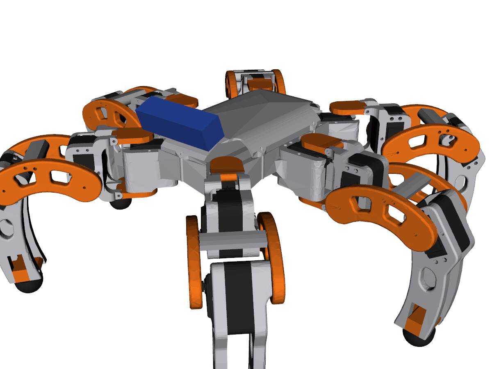

# hexapod_description

แพ็กเกจ ROS 2 สำหรับอธิบายโมเดลหุ่นยนต์ Hexapod (6 ขา ขาละ 3 DOF ได้แก่ Coxa–Femur–Tibia ขับด้วย servo TD-8135MG รวม 18 ตัว) แพ็กเกจนี้สร้างจาก `final1.SLDASM` โดย export เป็น STEP AP214 แล้วประมวลผลด้วย `tools/gen.py`

รองรับ **ROS 2 Jazzy + Gazebo Sim (Harmonic)** ร่วมกับ `gz_ros2_control` และมีเซนเซอร์ใน simulation ได้แก่ IMU, Depth Camera (RGB-D) และ contact sensor ที่ปลายเท้าทั้ง 6 ข้าง ซึ่งใช้จำลอง limit switch



## 1. โครงสร้างแพ็กเกจ

```
hexapod_description/
├── urdf/
│   ├── hexapod.urdf.xacro          # ไฟล์หลัก (arguments: use_sim, use_sensors, use_camera, use_joint_ft, use_ros2_control, use_electronics, show_electronics, controllers_file, fixed_base, fixed_base_z, payload_*)
│   ├── hexapod_properties.xacro    # AUTO-GENERATED: kinematics, mass, inertia (ห้ามแก้ด้วยมือ)
│   ├── hexapod_params.xacro        # แก้ได้: joint limits, servo effort/velocity, ตำแหน่งเซนเซอร์
│   ├── leg.xacro                   # macro ของขา 1 ข้าง
│   ├── sensors.xacro               # imu_link, camera_link, camera_optical_frame
│   ├── hexapod.ros2_control.xacro  # 18 position interfaces (Gazebo / mock hardware)
│   ├── hexapod.gazebo.xacro        # gz_ros2_control plugin, IMU, RGB-D camera, foot contact
│   ├── materials.xacro
│   └── hexapod.urdf                # URDF ที่ขยายแล้ว (ไม่ต้องใช้ xacro) สำหรับ PyBullet / Isaac Sim
├── meshes/visual/*.stl             # mesh แยกตามสี (grey / orange / dark) ใน frame ของ link
├── meshes/collision/*.stl          # convex hull (เท้าใช้ sphere)
├── config/controllers.yaml         # joint_state_broadcaster, leg_position_controller, leg_trajectory_controller
├── config/gz_bridge.yaml           # Gazebo → ROS 2 topics
├── worlds/flat.sdf, ramp.sdf       # พื้นราบ และทางลาด 15° (ใช้ทดสอบการสลับ Tripod → Wave gait)
├── launch/display.launch.py        # RViz + joint sliders
├── launch/gazebo.launch.py         # Gazebo + ros2_control + bridge (ทดสอบแพ็กเกจเดี่ยว)
├── rviz/display.rviz, hexapod_sim.rviz  # hexapod_sim.rviz ใช้โดย hexapod_bringup/sim.launch.py
├── doc/                            # mass report, ผล verification, ภาพ
└── tools/                          # pipeline สำหรับสร้างใหม่จาก CAD
```

## 2. นิยามเฟรมและท่าศูนย์ (Zero Pose)

- **base_link** อยู่ที่จุดกึ่งกลางของชิ้น `base` และเป็นไปตาม REP-103: x ชี้ไปด้านหน้า, y ชี้ไปทางซ้าย, z ชี้ขึ้น โดย `base_link` เป็น root link ที่ไม่มีมวล และ `body_link` (mesh + มวล/ความเฉื่อยของลำตัว) ยึดติดกับ `base_link` ด้วย fixed joint แบบ identity ทั้งสอง frame จึงอยู่ตำแหน่งเดียวกัน
  - ⚠️ **สมมติฐาน:** ด้านหน้าของหุ่นคือทิศ **+Z ของ SolidWorks** ซึ่งเป็นด้านที่หันเข้าหา Front view หากด้านหน้าจริงอยู่ฝั่งตรงข้าม ให้แจ้ง แล้วจะหมุน base_link และสลับชื่อขา F/R ให้
- **ชื่อขา:** `front_left, middle_left, rear_left, front_right, middle_right, rear_right` ตรงกับ `hexapod_kinematics.LEGS` ของ workspace (ชื่อย่อ `LF, LM, LR, RF, RM, RR` ใช้เฉพาะภายใน `tools/` และชื่อ property ใน `hexapod_properties.xacro`) จุดติดตั้ง coxa อยู่ที่ (±103.0, ±60.1) mm และ (0, ±92.3) mm ส่วนมุม yaw ของการติดตั้งคือ ±45°, ±90° และ ±135°
- **ท่าศูนย์ (ทุก joint = 0):** coxa ชี้ออกในแนวรัศมีตามทิศติดตั้ง, femur อยู่ในแนวระดับ, และ tibia ชี้ลงตรง (เส้นจากเข่าถึงจุดศูนย์กลางลูกบอลที่เท้า) ในท่านี้ base_link สูงจากพื้น 159.8 mm
- **ทิศบวกของ joint:** coxa หมุนทวนเข็มนาฬิกาเมื่อมองจากด้านบน, femur ยกเข่าขึ้น, tibia เหวี่ยงเท้าออกและขึ้น
- **frame `<leg>_foot_link`** อยู่ที่จุดศูนย์กลางของลูกบอลปลายเท้า (รัศมี 16.3 mm) ดังนั้นจุดสัมผัสพื้นอยู่ต่ำกว่า frame นี้ 16.3 mm ควรนำค่านี้ไปใช้ใน Inverse Kinematics

พารามิเตอร์ kinematics ของขาทุกข้างเหมือนกัน (คลาดเคลื่อนระหว่างขาไม่เกิน 0.1 mm):

| ช่วง | ค่า |
|---|---|
| Coxa: แกน coxa → แกน femur | 56.85 mm (แนวราบ), −19.44 mm (แนวดิ่ง) |
| Femur: แกน femur → แกน tibia | 80.00 mm |
| Tibia: แกน tibia → ศูนย์กลางลูกบอลที่เท้า | 130.03 mm (เยื้องด้านข้าง 2.0 mm) |

## 3. การใช้งาน

```bash
# ใน ROS 2 workspace
cd ~/ros2_ws/src && cp -r <path>/hexapod_description .
cd ~/ros2_ws && rosdep install --from-paths src -y --ignore-src && colcon build --symlink-install
source install/setup.bash

# RViz + joint sliders
ros2 launch hexapod_description display.launch.py

# Gazebo Sim
ros2 launch hexapod_description gazebo.launch.py                # พื้นราบ
ros2 launch hexapod_description gazebo.launch.py world:=ramp     # ทางลาด 15°

# สั่งตำแหน่งทั้ง 18 joint (ลำดับ front_left, middle_left, rear_left, front_right, middle_right, rear_right แต่ละขาเรียงเป็น coxa, femur, tibia)
ros2 topic pub --once /leg_position_controller/commands std_msgs/msg/Float64MultiArray \
  "{data: [0,0.3,-0.3, 0,0.3,-0.3, 0,0.3,-0.3, 0,0.3,-0.3, 0,0.3,-0.3, 0,0.3,-0.3]}"
```

| Topic (ROS 2) | Type | หมายเหตุ |
|---|---|---|
| `/joint_states` | sensor_msgs/JointState | จาก joint_state_broadcaster |
| `/leg_position_controller/commands` | std_msgs/Float64MultiArray | streaming command ที่มี latency ต่ำ เหมาะกับ gait generator |
| `/imu/data` | sensor_msgs/Imu | 200 Hz, frame `imu_link` (Gazebo topic `imu/data`) |
| `/camera/depth/image_raw`, `/camera/depth/points`, `/camera/color/image_raw`, `/camera/camera_info` | Image / PointCloud2 / CameraInfo | 30 Hz, frame `camera_optical_frame` |
| `/foot_contacts/<leg>` | ros_gz_interfaces/Contacts | จำลอง limit switch ใช้เงื่อนไข "มีข้อความ contact" = กดสวิตช์ (`<leg>` = front_left … rear_right) |
| `/tf` (odom → base_link) | tf2_msgs/TFMessage | ground truth จาก OdometryPublisher (Gazebo topic `odom_tf`) ใช้วัดผลเท่านั้น ห้ามป้อนเข้า AI |

ตารางด้านบนเป็นของ `launch/gazebo.launch.py` ในแพ็กเกจนี้ ส่วน stack เต็ม (`ros2 launch hexapod_bringup sim.launch.py`) ใช้ bridge ของ `hexapod_simulation/config/bridge.yaml` (เช่น point cloud ออกที่ `/camera/points` ใน frame `camera_link`)

**ข้อควรระวังด้าน real-time:** `controller_manager` ตั้งไว้ที่ 200 Hz หาก decision model หรือ gait planner ทำงานช้ากว่านี้ ควรส่ง command แบบ streaming ผ่าน `leg_position_controller` แทนการส่ง trajectory ทีละชุด เพื่อลด latency ช่วงสลับ gait นอกจากนี้ IMU (200 Hz) และ contact (200 Hz) มี rate สูงกว่ากล้อง (30 Hz) จึงควรใช้ `message_filters` หรือ timestamp alignment ในขั้น sensor fusion

### การเชื่อมต่อกับ ros2_ws (อินเทอร์เฟซที่แพ็กเกจอื่นพึ่งพา)

| สิ่งที่ต้องคงไว้ | ผู้ใช้ |
|---|---|
| coxa joint มี parent เป็น `body_link`, ชื่อ joint `<leg>_{coxa,femur,tibia}_joint`, `<leg>_foot_joint` | `hexapod_kinematics.CadRobotKinematics.from_urdf` |
| ลำดับและชื่อ 18 joint | `hexapod_bringup/config/controllers.yaml` (`hexapod_controller`), `hexapod_locomotion` |
| Gazebo topic `imu/data`, `camera`, `foot_contacts/<leg>`, `odom_tf` | `hexapod_simulation/config/bridge.yaml` |
| `camera_link`, `camera_optical_frame`, `odom → base_link` | `hexapod_simulation/points_frame_relabel.py`, `hexapod_perception/voxel_map_node` |
| `rviz/hexapod_sim.rviz` | `hexapod_bringup/sim.launch.py` |

`fixed_base:=true` ยึด base_link กับ world ที่ความสูง `fixed_base_z` (ค่าเริ่มต้น 0.30 m) ใช้เฉพาะการทดลอง E1 (`hexapod_evaluation/launch/e1_fixed_base.launch.py`)

xacro argument ที่ `sim.launch.py` ต้องส่ง: `use_sim:=true controllers_file:=<share>/hexapod_bringup/config/controllers.yaml` (ค่าเริ่มต้น `use_sim:=false` จะได้ mock hardware และไม่มี Gazebo plugin)

**ทิศบวกของ joint เปลี่ยนจาก URDF draft-1:** เดิม femur บวก = เท้าลง และ coxa บวก = ตามเข็มนาฬิกา ส่วนรุ่นนี้ femur บวก = ยกขึ้น และ coxa บวก = ทวนเข็มนาฬิกา โค้ดที่ใช้ IK จาก URDF ไม่ได้รับผลกระทบ แต่โค้ดที่ hard-code มุม joint (เช่น gesture `wave` ใน `hexapod_locomotion/planner.py`) และทิศทางเซอร์โวใน `hexapod_hardware` ต้องตรวจทานใหม่

## 4. ผลการตรวจสอบ (ดู `doc/verification_log.txt`)

- เมื่อตั้ง joint ตามมุมในไฟล์ CAD (`doc/cad_pose_joint_angles.json`) forward kinematics ให้ตำแหน่ง frame ตรงกับ CAD ทุก link คลาดเคลื่อนสูงสุด **0.08 mm** และ **0.0003°**
- ระยะของ visual mesh ใน URDF จากผิวชิ้นงาน CAD จริง: p99 ≤ 0.7 mm และสูงสุด ≤ 0.85 mm ซึ่งเป็นผลจากการลดจำนวน triangle
- ผ่าน `xacro` ทุกชุด argument, URDF validate ผ่าน และ inertia tensor ทุก link เป็น positive definite
- **ยังไม่ได้ทดสอบ:** การรันจริงใน Gazebo และ RViz เนื่องจากสภาพแวดล้อมที่ใช้สร้างไม่มี ROS 2 จึงควรทดสอบรอบแรกบนเครื่องจริง

## 5. สมมติฐานและค่าที่ใช้ (ปรับ 25 ก.ย. 2569)

| รายการ | ค่าที่ใช้ | สถานะ / ที่แก้ไข |
|---|---|---|
| แรงดันเซอร์โว | 6.0 V จาก PCB จ่ายไฟของผู้จัดทำ (3S LiPo → regulator 6.0 V 2 ตัว) | ตัดสินใจแล้ว |
| Effort / velocity limit | 3.29 N·m, 3.65 rad/s | **ประมาณเชิงเส้น** ระหว่างจุด datasheet 4.8 V และ 8.4 V ต้องยืนยันด้วยการวัด; `urdf/hexapod_params.xacro` |
| มวลชิ้นพิมพ์ | PETG 1.27 g/cm³ × fill factor ต่อชิ้น 0.64–1.00 (shell model: Bambu Lab A1, หัว 0.4 mm, 4 walls, honeycomb 40%) | ต้องชั่งชิ้นจริงเพื่อยืนยัน; `tools/mass_budget.yaml` → `python3 tools/mass_budget.py` |
| ปลายเท้า | TPU 1.21 g/cm³; `foot_mu` คง 1.0 เพื่อไม่ให้เท้าเป็นตัวจำกัดใน E3 | μ จริงของ TPU เป็นหัวข้อ Sim-to-Real |
| Safety factor มวล | × 1.15 กับทุก link และอุปกรณ์ที่ประมาณ (น็อต สายไฟ ขั้วต่อ กาว limit switch) ยกเว้นแบตเตอรี่ | `tools/mass_budget.yaml` |
| แบตเตอรี่ | BT LiPo 3S 11.1 V 7200 mAh 80C, 402 g, 138 × 45 × 32 mm อยู่**ในโครงลำตัว** (ร่องกลาง พื้น z −17 mm) | วัดจริง; ตำแหน่งใน `hexapod_params.xacro` |
| บอร์ด | RPi 5 + cooler ~66 g (ซ้าย), PCB ไฟ + PCA9685 × 2 ~83 g (ขวา) อยู่ในโครงลำตัว (ชั้นข้าง z −1 mm) | ประมาณ; ขนาด/ตำแหน่ง placeholder |
| มวลรวมในโมเดล | **4.15 kg** (ลำตัว 0.97, ขา 6 ข้าง 2.52, อิเล็กทรอนิกส์ 0.66) | `doc/mass_budget.md` |
| IMU | BNO055 ที่กึ่งกลางลำตัว, 100 Hz (fusion), noise จาก datasheet: accel 0.0104 m/s², gyro 0.0017 rad/s | ตำแหน่ง placeholder |
| Depth camera | D435i ขอบหน้าบนลำตัว ก้ม 28°, 424 × 240 @ 30 fps, HFOV 87°, 0.105–3.0 m | มุมจากการคำนวณ coverage; ต้องยืนยันกับ bracket จริง |
| Joint limits | ±90° รอบท่าศูนย์ ยังไม่ได้เทียบ neutral 1500 µs กับท่าศูนย์ | ต้องวัดจากหุ่นจริง |

**อุปกรณ์ในลำตัว:** `battery_link`, `compute_link`, `power_link` เป็น link ที่มีแต่มวล/ความเฉื่อย (ไม่มี collision และไม่มี visual) เพราะอยู่ภายในโครงลำตัว ภาพ RViz/Gazebo จึงเหมือน CAD; ใช้ `show_electronics:=true` เพื่อแสดงกล่องตรวจตำแหน่ง Gazebo รวม link ที่ต่อด้วย fixed joint เข้ากับ body_link อยู่แล้ว CoM ทั้งตัวที่ท่าศูนย์ (2.1, −0.2, −14.7) mm จาก base_link

**ผลต่อการทดลอง:** ระยะใต้ท้อง (ผิวล่างสุดของลำตัว z −30 mm) = 56 / 86 / 121 mm ที่ stance 70 / 100 / 135 mm → ขีดจำกัดความสูงสิ่งกีดขวางใน E5 แรงบิดสถิต femur ขณะยืน 3 ขา ≈ 1.09 N·m (33% ของ 3.29 N·m)

## 6. สร้างใหม่จาก CAD (tools/)

```bash
pip install cadquery-ocp trimesh fast_simplification pyyaml scipy yourdfpy xacro vtk
cd tools
python3 read_step.py <hexapod_final1_export.STEP>   # → leaves.json, meshes.pkl
python3 gen.py ..                                    # → meshes/, urdf/hexapod_properties.xacro, doc/
```
`kin.py` แบ่งชิ้นส่วนเข้า link ตามชื่อชิ้นงานใน assembly จึงต้องใช้ชื่อชิ้นงานเดิม ได้แก่ `coxa_top`, `femur_L`, `tibia_leg_R` เป็นต้น เมื่อเพิ่ม nut/bolt เข้า assembly แล้ว ให้กำหนดใน `link_of()` ว่าชิ้นส่วนเหล่านั้นอยู่ link ใด
